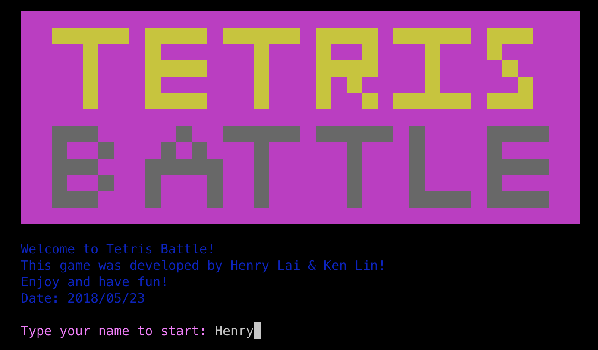
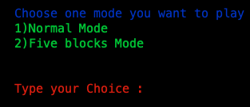
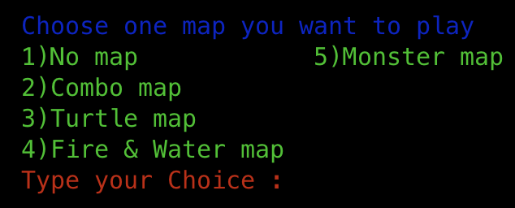
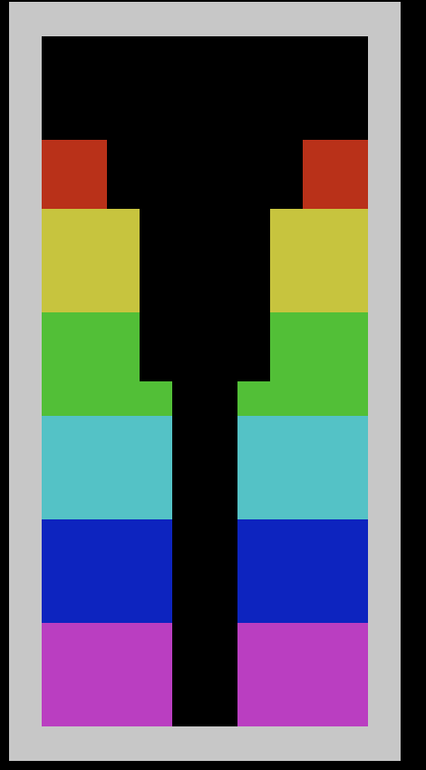
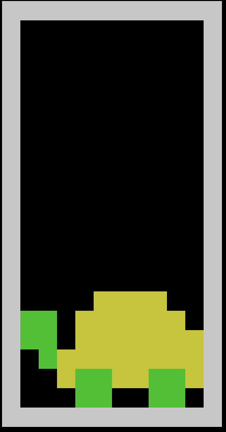
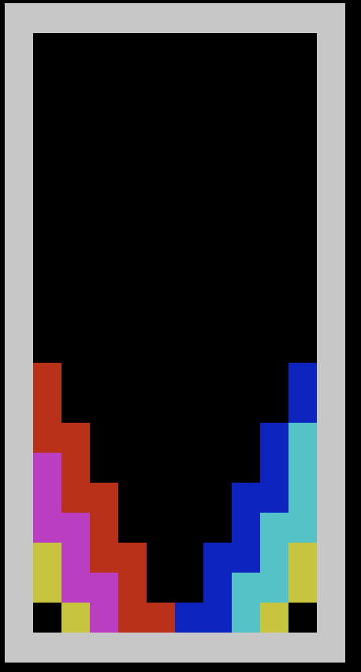
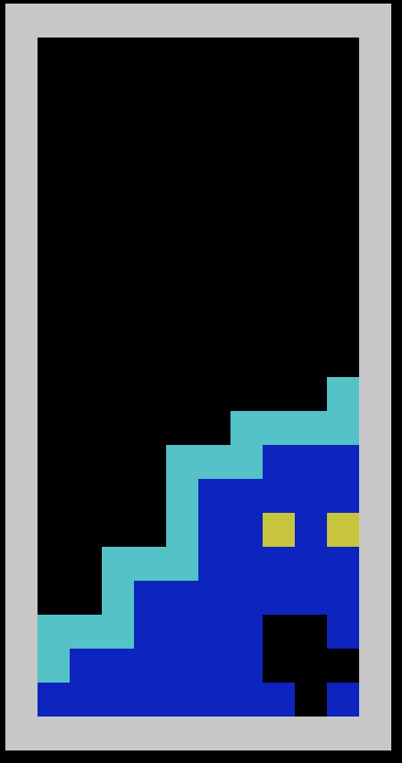
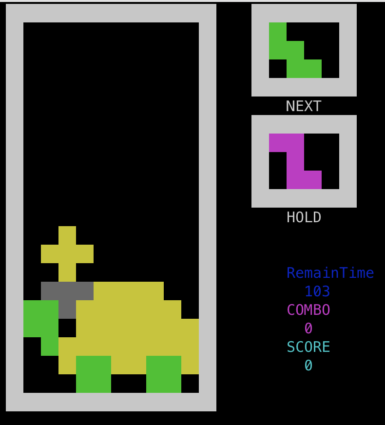

# 🧩 FiveBlock Tetris Battle

A colorful **terminal-based Tetris game** written in C++ featuring not only the traditional 4-block pieces, but also exciting **5-block Tetris** modes with various maps, difficulty settings, and battle-style design.



覺得對你有幫助嗎？歡迎在 GitHub 上點個 Star ⭐️，讓更多人看到這份資源！ Feel free to star this repository on GitHub if you find it helpful!

[](https://github.com/lhlaib/WuGeTetris) [](https://github.com/lhlaib)


---

## 🎮 Features

- 🧱 **Two Game Modes**:  
  - Classic 4-block Tetris  
  - Extended **Five-block Tetris Mode**
  
- 🗺️ **5 Map Options**:  
  - No Map  
  - Combo Map  
  - Turtle Map 🐢  
  - Fire & Water Map 🔥💧  
  - Monster Map 👾

- ⏱️ **3 Difficulty Levels**:  
  - Easy  
  - Normal  
  - Hard (Faster fall speed ⏩)

- 🕹️ **Controls**:
  - `←`, `→`, `↓` – Move blocks
  - `↑` – Rotate
  - `c` – Hold
  - `p` – Pause
  - `Enter` – Select in Menu

- 💾 **Rank System**:
  - Saves high scores using file I/O (`rank.in`)
  - Displays Combo, Score, and Remaining Time in real-time

---

## 🖼️ Screenshots

| Mode Selection                 | Map Selection                 |
| ------------------------------ | ----------------------------- |
|  |  |


| Combo Map                 | Turtle Map                 | Fire & Water Map              | Monster Map                 |
| ------------------------- | -------------------------- | ----------------------------- | --------------------------- |
|  |  |  |  |

| Five-block Gameplay             |
| ------------------------------- |
|  |


---

## 🛠️ How to Build and Run

### 📦 Requirements

- Linux/macOS Terminal
- C++ Compiler (`g++` recommended)
- ANSI Terminal Support

### 🧪 Compile

```bash
g++ main.cpp ken_test.cpp tesst.cpp testmain.cpp -o tetris -std=c++11
```

> You may also include other .cpp files if needed based on your structure.

###  ▶️ Run

```bash
./tetris
```

###  🗂️ File Structure

```
.
├── blocks.h           # Block logic and interface
├── game.h             # Game system class
├── map.h              # Different map settings
├── rank.h             # Rank system (file I/O + vector)
├── window.h           # Terminal display with gotoxy
├── main.cpp           # Entry point
├── tesst.cpp          # Supporting files
├── rank.in            # High scores
├── images/            # Screenshots for README
└── ...
```

## 📄 Final Report

For more technical details, class structure, and implementation logic, please refer to the full project report:

📘 [OOP Final Project Report – 五格方塊俄羅斯方塊 (PDF)](./images/OOP期末專題報告fianl.pdf)

### ✨ Credits

Developed by:
Henry Lai 
Ken Lin 

Special thanks to the OOP course team for guidance and support.

### 📜 License

MIT License. Feel free to use or modify for educational purposes.

Enjoy the nostalgic Tetris battle with a twist! 💥
